<div align="center">



</div>

<br>

## ◈ &nbsp;whoami

Prague-based developer. I build small products **end-to-end** — schema, API, UI, deploy, store
listing — and I treat LLMs as production components, not demos.

Right now that means AI developer work at **ON BOARD** during the day, and running my own iOS
app the rest of the time.

<br>

## ◈ &nbsp;things I've shipped

<table>
<tr><td width="50%" valign="top">

### ▲ Kcalori
**iOS calorie tracker · live on the App Store**

Local-first, no account required. SwiftUI shell wrapping a JS frontend in a `WKWebView`,
HealthKit sync, and in-app AI through an Anthropic proxy.

A focused redesign moved activation from **0 → ~60%**.

`SwiftUI` `WKWebView` `HealthKit` `Claude`

</td><td width="50%" valign="top">

### ▲ Citováno.ai
**Human-in-the-loop support agent**

The agent answers what it can, detects when a question actually needs a person (pricing),
posts a structured summary into Telegram, then delivers the human's `/reply` back to the
customer.

Built as a live assignment — the team was testing it in production chat the same week.

`Claude` `Cloudflare D1` `Telegram Bot API`

</td></tr>
<tr><td width="50%" valign="top">

### ▲ Marketing sites @ ON BOARD
**Next.js App Router rebuilds**

TypeScript, Tailwind, Drizzle + Postgres, server actions with honeypot + rate limiting,
consent-gated analytics. Content lives in data files so non-developers can change a price
without touching a component.

`Next.js` `TypeScript` `Drizzle` `PostHog`

</td><td width="50%" valign="top">

### ▲ Product configurator
**B2C multi-step configurator**

A rewrite of a legacy WordPress configurator into a standalone app — pulls product data over
REST, renders live previews, and hands a finished spec to sales.

`React` `REST` `WordPress` `Vercel`

</td></tr>
</table>

<br>

## ◈ &nbsp;stack

<div align="center">

</div>

<br>

## ◈ &nbsp;how I work

```diff
+ Ship it, then polish against real usage — not before
+ Content in data files, never hardcoded in components
+ If it isn't measured, it didn't happen — events and UTMs from day one
+ Check the contrast ratio before committing to the brand colour
- Building for six months in private and hoping
```

<br>

## ◈ &nbsp;find me

<div align="center">

[](https://www.linkedin.com/in/milan-marek-a5b78b390) [](https://kcalori.cz) [](https://github.com/milanmarekmm)

</div>

<br>

<div align="center">
<sub>Most of my repos here are private client work — the public surface is thin on purpose.<br>
Happy to walk through any of it.</sub>
</div>
