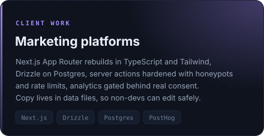
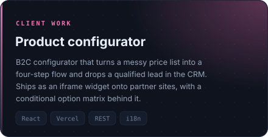
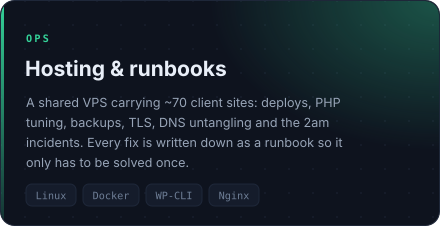

<div align="center">

<picture>
  <source media="(prefers-color-scheme: dark)"  srcset="assets/hero-dark.svg">
  <source media="(prefers-color-scheme: light)" srcset="assets/hero-light.svg">
  
</picture>

</div>

<br>

<div align="center">

<picture>
  <source media="(prefers-color-scheme: dark)"  srcset="assets/whoami-dark.svg">
  <source media="(prefers-color-scheme: light)" srcset="assets/whoami-light.svg">
  
</picture>

</div>

<br>

## ◇ &nbsp;Things I've shipped

<table>
<tr>
<td width="50%">

<a href="https://apps.apple.com/app/id6760182041?pt=128627423&amp;ct=github&amp;mt=8">
<picture>
  <source media="(prefers-color-scheme: dark)"  srcset="assets/card-kcalori-dark.svg">
  <source media="(prefers-color-scheme: light)" srcset="assets/card-kcalori-light.svg">
  
</picture>
</a>

</td>
<td width="50%">

<picture>
  <source media="(prefers-color-scheme: dark)"  srcset="assets/card-platforms-dark.svg">
  <source media="(prefers-color-scheme: light)" srcset="assets/card-platforms-light.svg">
  
</picture>

</td>
</tr>
<tr>
<td width="50%">

<picture>
  <source media="(prefers-color-scheme: dark)"  srcset="assets/card-configurator-dark.svg">
  <source media="(prefers-color-scheme: light)" srcset="assets/card-configurator-light.svg">
  
</picture>

</td>
<td width="50%">

<picture>
  <source media="(prefers-color-scheme: dark)"  srcset="assets/card-infra-dark.svg">
  <source media="(prefers-color-scheme: light)" srcset="assets/card-infra-light.svg">
  
</picture>

</td>
</tr>
</table>

<br>

## ◇ &nbsp;Toolbox

<div align="center">

<picture>
  <source media="(prefers-color-scheme: dark)"  srcset="assets/stack-dark.svg">
  <source media="(prefers-color-scheme: light)" srcset="assets/stack-light.svg">
  
</picture>

</div>

<br>

## ◇ &nbsp;How I work

```diff
+ Ship it, then polish against real usage — not before
+ Content in data files, so the people who own the words can change them
+ If it isn't measured it didn't happen — events and UTMs from day one
+ Check the contrast ratio before falling in love with the brand colour
+ Write the runbook while the incident is still fresh
- Six months of building in private, hoping
```

<details>
<summary><b>◇ &nbsp;What I actually mean by "LLMs as production components"</b></summary>

<br>

A model call is just an unreliable network dependency with a good vocabulary. So it gets
treated like one:

| Concern | How it's handled |
| :-- | :-- |
| **Cost** | Prompts through a proxy I own, so the key never ships to a client and spend is capped per user. |
| **Latency** | Stream early, cache aggressively, and never block a screen on a completion. |
| **Failure** | Every AI surface has a non-AI path. If the model is down, the app still works. |
| **Correctness** | Structured output with a schema, validated before it reaches a UI. Retry on mismatch, not on vibes. |
| **Privacy** | Nothing personal leaves the device that didn't need to. |

The interesting engineering isn't the prompt. It's everything wrapped around it.

</details>

<br>

## ◇ &nbsp;Find me

<div align="center">

<a href="https://www.linkedin.com/in/milanmarekmm">
<picture>
  <source media="(prefers-color-scheme: dark)"  srcset="assets/chip-linkedin-dark.svg">
  <source media="(prefers-color-scheme: light)" srcset="assets/chip-linkedin-light.svg">
  
</picture>
</a>
&nbsp;
<a href="https://kcalori.cz">
<picture>
  <source media="(prefers-color-scheme: dark)"  srcset="assets/chip-site-dark.svg">
  <source media="(prefers-color-scheme: light)" srcset="assets/chip-site-light.svg">
  
</picture>
</a>
&nbsp;
<a href="https://apps.apple.com/app/id6760182041?pt=128627423&amp;ct=github&amp;mt=8">
<picture>
  <source media="(prefers-color-scheme: dark)"  srcset="assets/chip-appstore-dark.svg">
  <source media="(prefers-color-scheme: light)" srcset="assets/chip-appstore-light.svg">
  
</picture>
</a>

</div>

<br>

<div align="center">
<sub>Most of what I build lives in private client repos — the public surface here is thin on purpose.<br>
Happy to walk through any of it.</sub>
<br><br>
<sub><code>assets/build.mjs</code> generates every graphic on this page in both themes — <code>node assets/build.mjs</code>.</sub>
</div>
